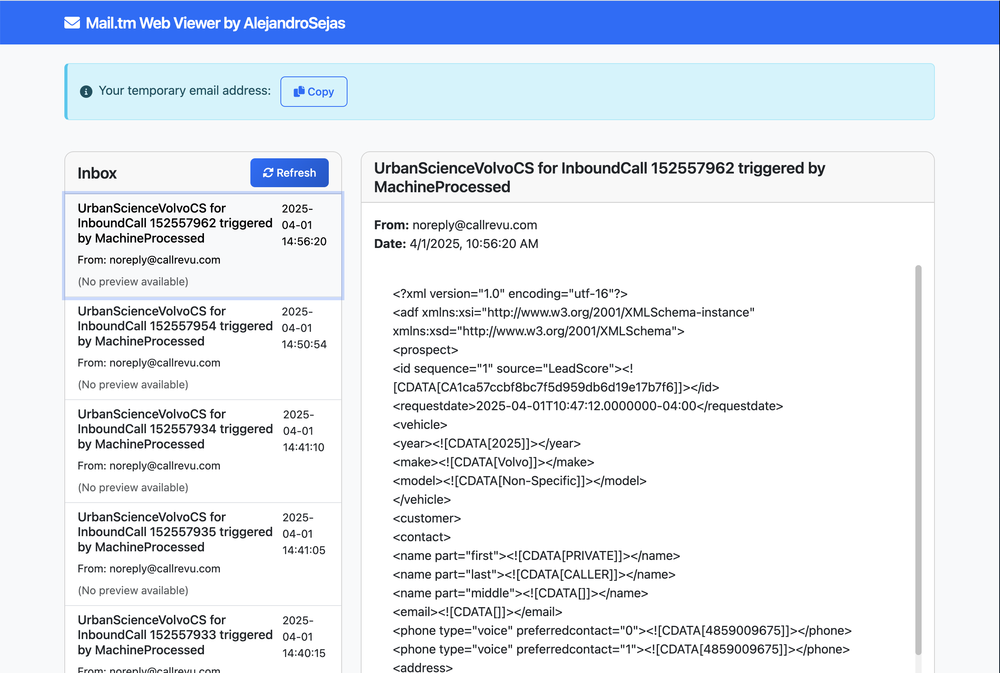

# Mail.tm Web Client

A sleek and modern web application that allows you to interact with your Mail.tm temporary email account. This Flask-based application provides a clean interface to view and manage your temporary emails.



## 🚀 Features

- **Real-time Email Viewing**: Access your Mail.tm emails through a clean web interface
- **Message Preview**: Quick preview of email content in the inbox view
- **Detailed Message View**: Read full email content with formatting
- **Auto-refresh**: Keep your inbox up to date with automatic refresh functionality
- **Responsive Design**: Works seamlessly on both desktop and mobile devices

## 🛠️ Technologies Used

- **Backend**: Python Flask
- **API Integration**: Mail.tm REST API
- **Frontend**: HTML, CSS, JavaScript
- **Authentication**: JWT Token-based
- **Environment Management**: python-dotenv

## 📋 Prerequisites

- Python 3.8 or higher
- A Mail.tm account (you can create one at [mail.tm](https://mail.tm))

## 🔧 Installation

1. Clone the repository:

   ```bash
   git clone https://github.com/yourusername/mail.tm.git
   cd mail.tm
   ```

2. Create a virtual environment and activate it:

   ```bash
   python -m venv venv
   source venv/bin/activate  # On Windows, use: venv\Scripts\activate
   ```

3. Install the required dependencies:

   ```bash
   pip install -r requirements.txt
   ```

4. Create a `.env` file in the project root with your Mail.tm credentials:
   ```
   MAIL_TM_EMAIL=your_email@mail.tm
   MAIL_TM_PASSWORD=your_password
   FLASK_SECRET_KEY=your_secret_key
   ```

## 🚀 Running the Application

1. Start the Flask server:

   ```bash
   python app.py
   ```

2. Open your web browser and navigate to:
   ```
   http://localhost:8000
   ```

## 🔒 Security Notes

- Never commit your `.env` file to version control
- Keep your Mail.tm credentials secure
- Regularly rotate your Flask secret key

## 📝 License

## This project is licensed under the MIT License - see the [LICENSE](LICENSE) file for details.

⭐️ If you found this project helpful, please give it a star!
